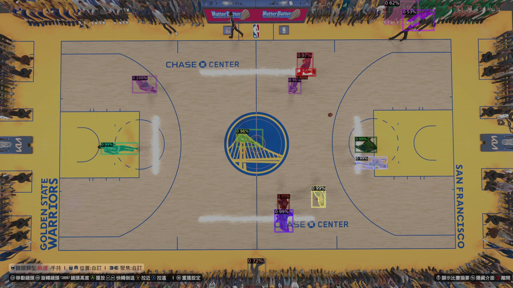
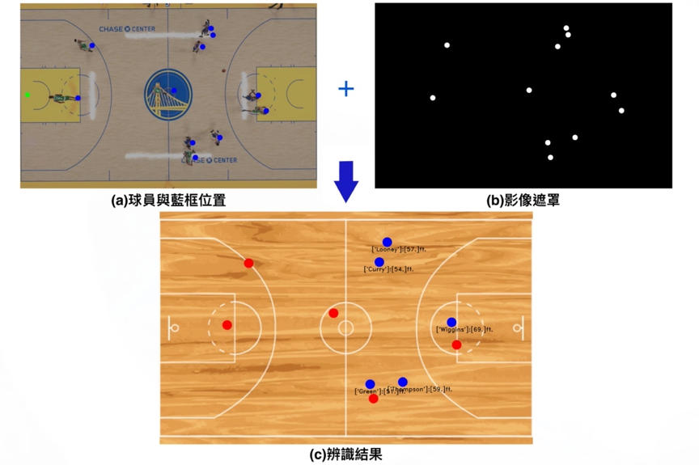
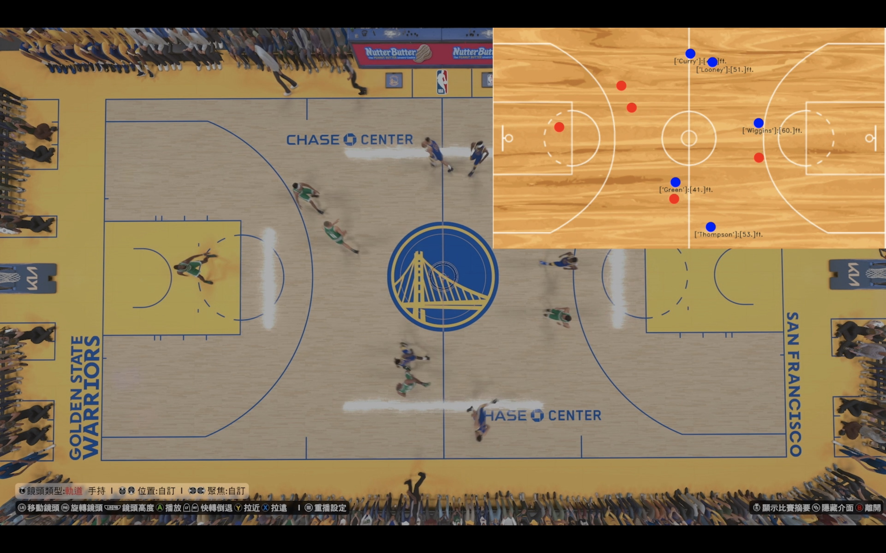
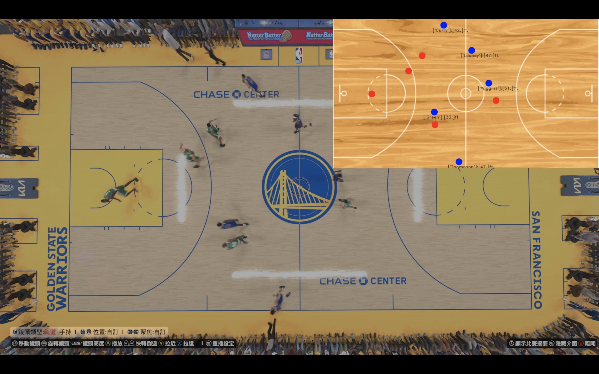
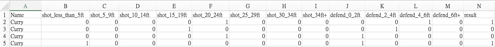
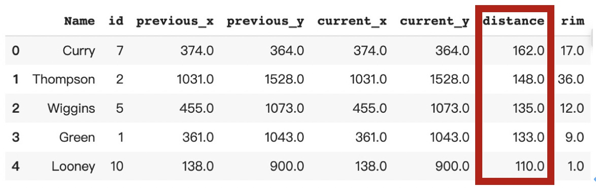

# 應用影像辨識Detectron2預測籃球比賽命中率與球員疲勞狀況
## 專題摘要
研究目標為嘗試將影像分析技術（Detectron2）與統計知識結合，針對籃球影片球員的位置變化，透過與籃框距離和防守者距離等變數預測命中率，並利用球員移動距離、速度、命中率變化等因素，試圖透過影像評估球員的疲勞狀況，以供教練訓練與實戰時參考。我將此研究主要分為三個部分：
### 1. 影像辨識取得球員位置
若想要進行後續的命中率預測與疲勞狀況分析，第一步必須先掌握各個球員的位置分布與移動狀況，因此我使用由Meta所開發的Detectron2訓練自己的物件偵測模型。而因為考量到能在網路上取得的影片幾乎皆是傳統電視轉播視角，為了轉播效果時常不斷切換攝影機角度、特寫縮放，這些轉播變數將會大大影響最終的研究成果，因此影片來源則選擇透過目前市面上最成熟的籃球遊戲模擬器NBA 2K24，由AI控制雙方球隊，並依照適合的角度進行畫面錄製擷取。

籃球是一項充滿肢體接觸與碰撞的運動，再加上現今籃球戰術發展日新月異，產生各種擋人掩護製造空檔的方式，因此時常會有人物遮蔽重疊的現象，為了盡量改善此問題，我將攝影機角度設為天花板俯視，不過在影像辨識的過程中仍舊難免會遭遇人物重疊的難題。下圖為使用自行訓練的Detectron2模型所產生的球員偵測狀況。

成功偵測球員後，接下來則是將每位球員在球場上標點做記號，圖(a)中藍色點為球員位置，綠色點則是籃框位置。完成標點後透過影像遮罩的技術，儲存球員與籃框的位置，如圖(b)，由此便能將球員繪製於2D平面籃球場圖形，使教練更容易了解場上概況，最終結果如圖(c)所示，紅色點為防守球員，藍色為進攻方球員，底下黑體字代表球員名字和與攻擊籃框之間距離。

上述為辨識一張圖片的過程，然而若想辨識一段影片則需更複雜的處理，需將影片依照幀數分割成無數張圖片，一張一張獨立辨識後再重組而成影片。因此我親手設計了一個球員追蹤的機制，能記錄每次的辨識結果，讓每張圖片能接續前一張圖片，使其連貫，最終完成影片的影像辨識，以下為部分成果的截圖。

### 2.	預測球員命中率
經過第一步影像辨識後，便能取得每位進攻球員與籃框、最近防守者之間的相對距離。因為投籃的結果屬於類別變數，只有分為進與沒進兩種結果，因此對每位球員建立各自的羅吉思迴歸模型，反應變數為投籃結果，解釋變數則包含與籃框之間距離、與最近防守者之間距離，依照各種距離分類，設定成多種Dummy Variable，透過羅吉斯迴歸分析預測每次的投籃結果，資料集如圖所示，其中最右邊的result變數代表投籃結果，1代表進球，0代表沒進。

### 3.	球員疲勞狀況
透過先前的影像辨識，同時也可以取得球員每個攻守回合的移動距離，範例資料如下圖所示，distance變數為其中一回合的總移動距離，將一場比賽每名球員每個回合的移動距離、平均移動速度繪製成折線圖。當球員疲勞時，預期會影響其移動能力與速度，透過折線圖將可觀察球員的移動能力變化，進而推斷其體能狀況。

除此之外，若能取得球員平時訓練時的體能資料，觀測在體能充足下的移動狀況，就能將「訓練」與「比賽」的資料對比，透過統計上的T檢定判斷兩組移動資料是否有明顯的差異。當檢定結果為有明顯差異時，便能斷定該名球員的移動能力與平時相比有所下滑，教練能以此為依據進行輪替，調節球員體能。
